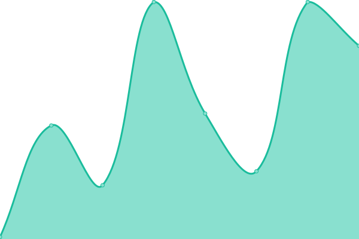
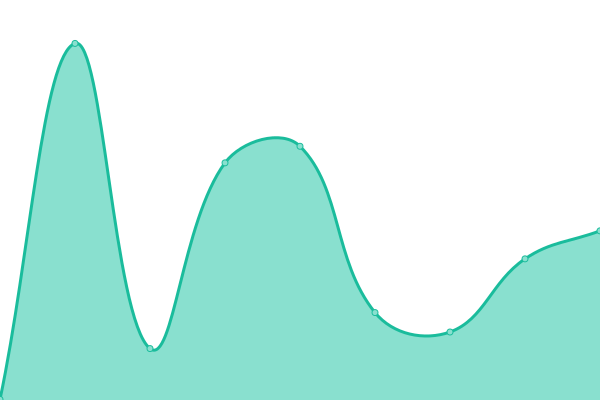
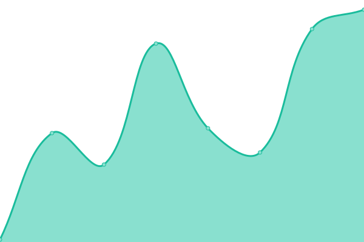
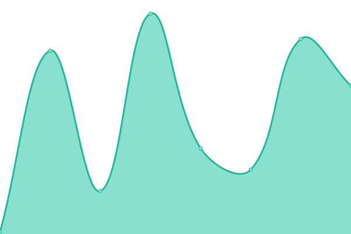

# [📈 Live Status](https://nlbao.github.io/uptime): <!--live status--> **🟩 All systems operational**

This repository contains the open-source uptime monitor and status page for [Bao Nguyen](https://nlbao.github.io/uptime), powered by [Upptime](https://github.com/upptime/upptime).

With [Upptime](https://upptime.js.org), you can get your own unlimited and free uptime monitor and status page, powered entirely by a GitHub repository. We use [Issues](https://github.com/nlbao/uptime/issues) as incident reports, [Actions](https://github.com/nlbao/uptime/actions) as uptime monitors, and [Pages](https://nlbao.github.io/uptime) for the status page.

<!--start: status pages-->
<!-- This summary is generated by Upptime (https://github.com/upptime/upptime) -->
<!-- Do not edit this manually, your changes will be overwritten -->
<!-- prettier-ignore -->
| URL | Status | History | Response Time | Uptime |
| --- | ------ | ------- | ------------- | ------ |
|  [nlbao.page](nlbao.page) | 🟩 Up | [nlbao-page.yml](https://github.com/nlbao-bot/uptime/commits/HEAD/history/nlbao-page.yml) | 

 500ms
     
 | 

<a href="https://nlbao-bot.github.io/uptime/history/nlbao-page">100.00%</a>
    

|  [nlbao.netlify.app](nlbao.netlify.app) | 🟩 Up | [nlbao-netlify-app.yml](https://github.com/nlbao-bot/uptime/commits/HEAD/history/nlbao-netlify-app.yml) | 

 451ms
     
 | 

<a href="https://nlbao-bot.github.io/uptime/history/nlbao-netlify-app">100.00%</a>
    

|  [nlbao.github.io](https://nlbao.github.io) | 🟩 Up | [nlbao-github-io.yml](https://github.com/nlbao-bot/uptime/commits/HEAD/history/nlbao-github-io.yml) | 

 62ms
     
 | 

<a href="https://nlbao-bot.github.io/uptime/history/nlbao-github-io">100.00%</a>
    

|  [nlbao-bot.github.io/uptime](https://nlbao-bot.github.io/uptime) | 🟩 Up | [nlbao-bot-github-io-uptime.yml](https://github.com/nlbao-bot/uptime/commits/HEAD/history/nlbao-bot-github-io-uptime.yml) | 

 61ms
     
 | 

<a href="https://nlbao-bot.github.io/uptime/history/nlbao-bot-github-io-uptime">100.00%</a>
    

|  Secret Site | 🟩 Up | [secret-site.yml](https://github.com/nlbao-bot/uptime/commits/HEAD/history/secret-site.yml) | 

 374ms
     
 | 

<a href="https://nlbao-bot.github.io/uptime/history/secret-site">100.00%</a>
    

|  [anla11.github.io](https://anla11.github.io/) | 🟩 Up | [anla11-github-io.yml](https://github.com/nlbao-bot/uptime/commits/HEAD/history/anla11-github-io.yml) | 

 44ms
     
 | 

<a href="https://nlbao-bot.github.io/uptime/history/anla11-github-io">100.00%</a>
    

|  [Test for HEAD](https://www.google.com) | 🟩 Up | [test-for-head.yml](https://github.com/nlbao-bot/uptime/commits/HEAD/history/test-for-head.yml) | 

 54ms
     
 | 

<a href="https://nlbao-bot.github.io/uptime/history/test-for-head">100.00%</a>
    

<!--end: status pages-->

[**Visit our status website →**](https://nlbao.github.io/uptime)

## 📄 License

- Powered by: [Upptime](https://github.com/upptime/upptime)
- Code: [MIT](./LICENSE) © [Bao Nguyen](https://nlbao.github.io/uptime)
- Data in the `./history` directory: [Open Database License](https://opendatacommons.org/licenses/odbl/1-0/)
